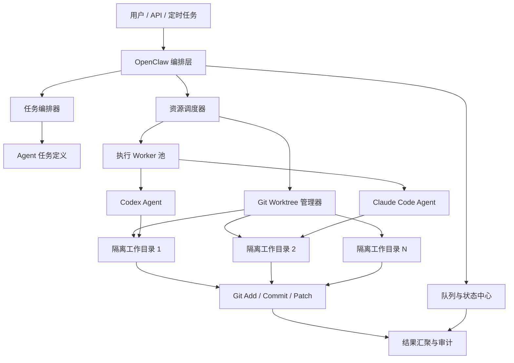

# 3. 架构白皮书：基于 OpenClaw 的双层集群设计

## 文档目标

本文档描述一种面向研发与文档生产场景的 Agent 集群系统设计。系统以上层 OpenClaw 编排层与下层 Codex/Claude Code 执行层构成双层架构，通过 Git Worktree 隔离、多任务并发调度、后台状态回传与统一审计机制，实现可扩展、可回溯、可并发的自动化交付流程。

## 一、产品概述

该系统的核心目标不是构建单个“大模型助手”，而是构建一个可被批量调度的 Agent 生产平台：

- OpenClaw 负责接收任务、拆分工作流、分配执行资源、追踪生命周期。
- Codex 与 Claude Code 负责在隔离的代码工作区内执行具体任务，例如生成文档、修改代码、运行测试、整理结果。
- Git Worktree 负责提供轻量级、低冲突的代码隔离能力，使多个 Agent 可以围绕同一仓库并行工作。
- 后台并发机制负责控制任务队列、进程池、资源配额、失败重试与结果汇聚。

该产品适用于以下场景：

- 批量文档生产与知识库维护
- 多分支代码改造与并行修复
- 大型需求拆解后的子任务协同
- 自动化评审、验证与交付流水线

## 二、总体架构

系统采用双层架构，强调“编排”和“执行”分离。



### 2.1 OpenClaw 编排层

OpenClaw 作为控制平面，负责以下能力：

- 接入外部请求，包括 UI、CLI、Webhook、定时任务和内部 API。
- 将高层需求转化为标准任务描述，例如目标仓库、输入上下文、交付物路径、验收条件。
- 按任务类型选择执行策略，例如单 Agent 执行、主从式协同、并行子任务、串行审批流。
- 记录任务状态，从 `queued`、`running`、`blocked` 到 `completed`、`failed`。

这一层不直接承担代码修改，而是专注于任务定义、状态管理和资源编排。

### 2.2 Codex / Claude Code 执行层

执行层是实际产出代码与文档的工作平面。Codex 与 Claude Code 可以被视为两类具备不同风格和能力侧重的执行引擎：

- Codex 更适合代码库探索、补丁生成、命令执行、工程化修改。
- Claude Code 更适合长文档撰写、复杂上下文整理、较长链路的推理与总结。

在产品设计上，这两类 Agent 不应直接共享工作目录，而应通过标准任务输入和标准输出协议协作：

- 输入包括任务说明、相关文件清单、约束、验收标准。
- 输出包括变更文件、执行日志、结构化结果、风险说明、提交记录。

双执行引擎可以带来三个直接收益：

- 降低对单一模型能力边界的依赖
- 允许按任务类型动态路由
- 支持交叉评审、互为校验

## 三、双层架构的工作流

一个典型任务的执行过程如下：

1. 用户向 OpenClaw 提交任务，例如“在当前仓库生成某主题文档并提交”。
2. OpenClaw 解析任务元数据，识别仓库路径、目标分支、输出文件、是否允许提交。
3. 调度器为任务分配独立 Worker，并申请一个新的 Git Worktree。
4. Worker 在隔离目录中启动 Codex 或 Claude Code。
5. Agent 扫描仓库、读取上下文、生成或修改文件。
6. Worker 执行验证动作，例如检查目标文件是否存在、是否有 diff、是否满足格式要求。
7. 若任务允许提交，则在当前隔离 worktree 中执行 `git add`、`git commit`。
8. OpenClaw 回收执行结果，将元数据写入状态中心，并决定是否触发后续任务。

这个流程中，OpenClaw 负责“派工和监管”，执行 Agent 负责“实际干活”。

## 四、Git Worktree 隔离机制

### 4.1 为什么选择 Git Worktree

在多 Agent 并发场景下，直接让多个执行器共享同一个工作目录会产生明显问题：

- 文件修改互相覆盖
- Git 索引冲突
- 临时文件相互污染
- 分支切换影响其他任务
- 任务失败后难以追溯现场

Git Worktree 提供了一种比重复克隆更轻量的隔离方式。它共享对象数据库，但提供独立的工作目录和 HEAD 指针，因此非常适合作为 Agent 的任务沙箱。

### 4.2 隔离策略

建议采用以下目录和命名策略：

```text
/repo/.git
/worktrees/task-20260302-001-codex
/worktrees/task-20260302-002-claude
/worktrees/task-20260302-003-review
```

每个任务实例至少具备以下元数据：

- `task_id`：全局唯一任务编号
- `repo_id`：目标仓库标识
- `base_branch`：任务基线分支
- `worktree_path`：隔离目录路径
- `agent_type`：codex 或 claude-code
- `lease_owner`：当前占用该 worktree 的 worker

### 4.3 创建与回收流程

标准流程如下：

1. 从目标仓库的基线分支创建 worktree。
2. 将任务上下文挂载到该目录。
3. 在该目录中启动 Agent 会话。
4. 任务结束后收集 diff、日志、提交信息。
5. 若任务完成或超时，执行 worktree 清理与 lease 释放。

这套机制的关键不是“能创建 worktree”，而是“能稳定回收 worktree”。如果回收逻辑缺失，后台系统很快会被遗留目录、悬挂分支和失效锁占满。

### 4.4 Git 隔离的产品价值

- 并发安全：多个 Agent 可围绕同一仓库同时工作
- 可追溯：每个任务都能定位到独立目录和独立 diff
- 易审计：提交记录、日志和产物可绑定到单个任务
- 易恢复：失败任务可以保留现场进行人工检查
- 成本低：相较完整克隆，占用磁盘和初始化时间更低

## 五、后台并发机制

后台并发系统是整个产品能否规模化运行的决定性因素。

### 5.1 核心组件

- 任务队列：接收待执行任务，支持优先级、重试、延迟调度。
- 调度器：根据仓库、模型类型、系统负载选择执行节点。
- Worker 池：负责实际拉起 Agent 进程并监控运行状态。
- 状态中心：保存任务心跳、阶段状态、标准输出、错误信息。
- 结果汇聚器：对 diff、日志、提交 hash、结构化产物进行归档。

### 5.2 并发模型

推荐采用“队列 + Worker 池 + 有界并发”的模式：

- 每个 Worker 同时只绑定一个活跃任务，避免上下文串扰。
- 每个仓库设置最大并发数，防止同仓库过度竞争。
- 每个模型类型设置独立配额，防止某一执行器耗尽全部资源。
- 每个任务设置超时、心跳过期和最大重试次数。

一个简化的调度逻辑如下：

```text
submit task
-> queue by priority
-> check repo concurrency quota
-> allocate worker
-> allocate worktree
-> launch agent process
-> stream logs and heartbeat
-> validate outputs
-> collect result
-> cleanup or retain sandbox
```

### 5.3 后台并发中的关键控制点

#### 任务级隔离

每个任务必须具备独立的：

- worktree 目录
- 执行日志
- 临时文件目录
- 进程上下文
- 状态机实例

否则系统会出现“日志混写、结果串单、清理误删”等典型问题。

#### 仓库级限流

即使使用 Git Worktree，同一仓库上的高并发任务仍可能争抢：

- Git 锁文件
- 包管理缓存
- 测试端口
- 构建缓存目录

因此调度器应支持“按仓库限流”，例如单仓库默认同时运行 2 到 4 个任务。

#### 会话心跳与超时回收

执行 Agent 不是普通函数调用，而是可能长时间运行的外部进程。系统必须通过心跳机制持续判断任务是否存活：

- 心跳正常：继续运行
- 心跳超时：标记为 `stalled`
- 多次超时：触发强制中止与工作区回收

#### 失败重试与幂等

失败重试必须区分失败类型：

- 调度失败：可直接重试
- worktree 创建失败：可切换目录后重试
- 模型调用失败：可指数退避重试
- 文件校验失败：应保留现场，避免无意义重复执行

要实现可靠重试，任务输入必须幂等，输出路径必须可判定，提交动作必须在最终校验之后进行。

## 六、Agent 协作模式

在双引擎架构下，常见的协作模式有三类。

### 6.1 单 Agent 执行

适用于单文档生成、单文件修复、小范围代码调整。

特点：

- 实现简单
- 成本最低
- 路径最短

### 6.2 主从式协同

OpenClaw 先指定主 Agent 负责主任务，再将细分子任务派发给其他 Agent。

例如：

- Claude Code 负责长文档结构设计与初稿撰写
- Codex 负责读取仓库、补齐命令细节、校验文件路径与 Git 动作

这种模式适合兼顾文字质量和工程准确性。

### 6.3 并行子任务模式

将复杂任务拆成多个并行分支，例如：

- 一个 Agent 负责编写架构说明
- 一个 Agent 负责编写部署与运维部分
- 一个 Agent 负责审查一致性并统一术语

最终由汇聚器或主 Agent 合并结果。此模式吞吐量最高，但对任务拆分质量要求也最高。

## 七、关键产品能力设计

### 7.1 标准任务协议

建议所有任务统一为如下结构：

```yaml
task_id: task-20260302-001
repo: docs-agent-workflow
base_branch: main
agent: codex
goal: 生成 docs/agent-workflow.md 并提交
inputs:
  - architecture
  - git isolation
  - backend concurrency
constraints:
  - 中文输出
  - 允许 git commit
deliverables:
  - docs/agent-workflow.md
acceptance:
  - 文件存在
  - 内容覆盖指定主题
  - 若有变更则已提交
```

统一协议可以降低编排器和执行器之间的耦合成本。

### 7.2 审计与可观测性

一个可用于生产的 Agent 集群系统，必须默认具备以下可观测能力：

- 任务创建时间、开始时间、结束时间
- 执行器类型与版本
- worktree 路径与基线分支
- 命令执行日志
- 文件变更摘要
- 提交 hash 与失败原因

如果没有这层审计，系统一旦出现误修改、错误提交或资源泄漏，排查成本会迅速失控。

### 7.3 人工接管机制

当任务出现以下情况时，系统应支持人工接管：

- 多次重试仍失败
- 生成结果低于阈值
- 提交前校验存在风险
- 同一仓库出现冲突任务

人工接管最有价值的前提，是系统保留了完整 worktree 现场和执行轨迹。

## 八、典型部署形态

### 8.1 单机版

适用于个人或小团队：

- OpenClaw 编排服务
- 本地任务队列
- 本地 Worker 池
- 本地 Git 仓库与 Worktree 目录

优点是简单，缺点是资源上限明显。

### 8.2 多节点版

适用于团队级并发：

- OpenClaw 作为中心控制平面
- 共享任务队列
- 多台执行节点部署 Worker
- 每台节点本地维护仓库镜像和 Worktree 池

这种架构更适合大批量任务，但需要额外解决节点调度、仓库同步和凭据管理问题。

## 九、风险与治理建议

该系统虽然能显著提升并行产出能力，但也带来新的工程治理要求：

- 权限控制：限制哪些任务允许自动提交
- 分支策略：避免直接写入受保护分支
- 资源治理：控制模型调用成本、磁盘占用和并发上限
- 输出校验：对高风险任务增加 lint、测试、审阅门禁
- 清理策略：对过期 worktree 和失败残留做周期回收

建议将“自动执行能力”与“自动提交能力”分级开放，而不是默认全部放开。

## 十、结论

基于 OpenClaw 与 Codex/Claude Code 的双层架构 Agent 集群系统，本质上是一套面向自动化交付的控制平面与执行平面组合方案。OpenClaw 负责任务编排和生命周期治理，Codex/Claude Code 负责实际产出，Git Worktree 负责隔离与并发安全，后台调度系统负责吞吐、回收和稳定性。

当这四部分被统一设计后，系统才能从“单次可用的 AI 助手”升级为“可持续运行的 Agent 生产基础设施”。这也是该类产品从演示走向生产的关键分水岭。
